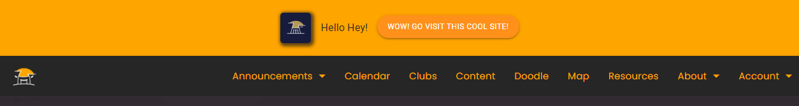

# Configs
This file serves as documentation for the various possible configurations for the backend.

### Banners

This section contains the configuration for the banners that appear on the main site. The format is as follows:

<sub>*local_settings.py*</sub>
```py
BANNER_REFERENCE_TIME = datetime.strptime("2023-11-14", "%Y-%m-%d").replace(tzinfo=timezone.utc)
# ^ not required, but recommended to set to whatever the start date/time
BANNER3 += [ 
       dict(
           start=BANNER_REFERENCE_TIME, # when to start displaying the banner
           end=BANNER_REFERENCE_TIME + timedelta(days=5), # when to stop displaying the banner (e.g. 5 days after start)
           content="Hello Hey!", # banner text
           icon_url="/static/core/img/logo/logo-maskable-192.png", # optional, displays an icon on the left of the banner
           cta_link="https://jasoncameron.dev", # optional 
           cta_label="wow! go visit this cool site!", # optional (but required if cta_link is present)
       )
]
``` 
the final result will look something like this (depending on the theme)



### Themes
This section contains the configuration for the themes that appear on the main site. The format is as follows:

The options are as follows 
- spring
- summer
- autumn
- winter
- valentines
- halloween
- remembrance
- christmas
- 39 (same as spring with a slightly lighter header)

#### How to change theme
<sub>*local_settings.py*</sub>
```py
CURRENT_THEME = "halloween" # or any of the other options
```

#### How to add a theme

##### Step 1: Create the theme css & logo
1. CSS
   1. Go to `core/static/core/css/themes`
   2. Write your css & create a new css file with the name of the theme (e.g. `halloween-theme.css`) 
   3. go to ./banners and add your css for the banner (e.g. `halloween-banner.css`)
2. Images 
   1. go to `core/static/core/img/themes/banners`
   2. add your banner image (e.g. `halloween.jpg`)
   3. go to `core/static/core/img/themes/logos`
   4. add your logo (e.g. `halloween.png`) **AND** a maskable version (e.g. `halloween-transparent.png`)
3. Add the theme to django

<sub>*settings.py*</sub>

find the THEMES dictionary & add your theme to the list 
e.g.
```py
 "halloween": {
        "banner": "/static/core/img/themes/banners/halloween.jpg",
        "banner_css": "/static/core/css/themes/banners/halloween-banner.css",
        "logo": "/static/core/img/themes/logos/halloween-transparent.png",
        "theme": "/static/core/css/themes/halloween-theme.css",
    },
```
